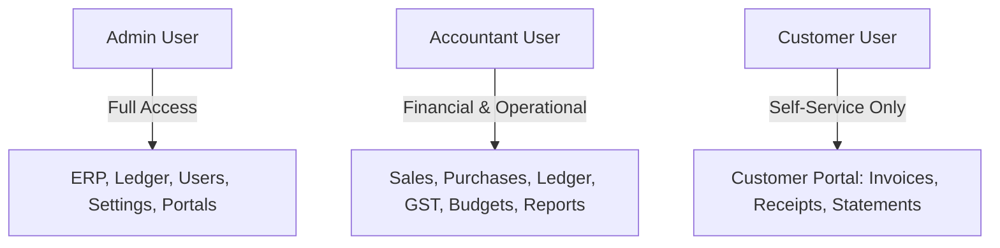

# 🛋️ Urban Furniture Accounting & ERP — Complete User Manual

> **The Definitive Operational & Technical Guide**  
> An enterprise-grade guide explaining **WHY** this system exists, **WHERE** each module lives, and **HOW** to use every workflow from sales and inventory to double-entry ledger postings, Indian GST compliance, and AI executive intelligence.

---

## 📑 Table of Contents
1. [🌟 The "WHY" — Purpose & Problem Solved](#1--the-why--purpose--problem-solved)
2. [🧭 The "WHERE" — System Map & Navigation Directory](#2--the-where--system-map--navigation-directory)
3. [🔐 User Roles & Access Control (RBAC)](#3--user-roles--access-control-rbac)
4. [🚀 Quick Setup & Installation Guide](#4--quick-setup--installation-guide)
5. [📖 The "HOW" — End-to-End Operational Workflows](#5--the-how--end-to-end-operational-workflows)
   - [Workflow A: Sales Cycle & Invoicing (Commercial Demand)](#workflow-a-sales-cycle--invoicing-commercial-demand)
   - [Workflow B: Procurement & Vendor Settlement (Supply Chain)](#workflow-b-procurement--vendor-settlement-supply-chain)
   - [Workflow C: Perpetual Inventory & Reorder Alerts](#workflow-c-perpetual-inventory--reorder-alerts)
   - [Workflow D: Double-Entry Ledger & Financial Statements](#workflow-d-double-entry-ledger--financial-statements)
   - [Workflow E: Indian GST Compliance & Tax Reports](#workflow-e-indian-gst-compliance--tax-reports)
   - [Workflow F: Master-Data Excel/CSV Import](#workflow-f-master-data-excelcsv-import-customers--products)
6. [🤖 AI Intelligence Suite: How & When to Use](#6--ai-intelligence-suite-how--when-to-use)
   - [AI Executive Business Summary](#-ai-executive-business-summary)
   - [Contextual AI "Why?" Explanations](#-contextual-ai-why-explanations)
   - [Talk to Your Ledger Assistant](#-talk-to-your-ledger-assistant)
   - [Customer Credit & Vendor Performance Scoring](#-customer-credit--vendor-performance-scoring)
7. [🔎 Global Command Palette (`Ctrl + K`)](#7--global-command-palette-ctrl--k)
8. [🧪 Automated Testing & Verification](#8--automated-testing--verification)
9. [🎬 5–7 Minute Judge Demo Script & Presentation Flow](#9--57-minute-judge-demo-script--presentation-flow)
10. [❓ Frequently Asked Questions & Troubleshooting](#10--frequently-asked-questions--troubleshooting)


---

## 1. 🌟 The "WHY" — Purpose & Problem Solved

### The Real-World Accounting Dilemma
Standard ERPs and simple invoice tools fall into two dangerous extremes:
1. **Shallow Invoice Tools**: Allow editing amounts freely, creating phantom revenue without matching double-entry ledger items, resulting in tax penalties and audit failures.
2. **Monolithic Legacy Systems**: Too rigid, unreadable, and lack real-time predictive analytics to warn management before cash or stock runs out.

### What Urban Furniture Solves
Designed specifically for high-turnover furniture manufacturing, wholesale, and retail, **Urban Furniture Accounting & ERP** enforces:
- **Strict Non-Repudiation**: Every commercial invoice or bill auto-creates immutable debit/credit vouchers in the General Ledger. Total Debits must always equal Total Credits ($\sum \text{Dr} \equiv \sum \text{Cr}$).
- **Indian GST Adherence**: Built-in support for 0%, 5%, 12%, and 18% GST tax rate slabs with automated splitting of IGST (Inter-State) vs. CGST + SGST (Intra-State).
- **Perpetual Warehouse Inventory**: Physical stock levels automatically deplete upon sales delivery and replenish upon vendor receipt, closing the inventory-to-procurement loop.
- **Predictive AI Decision Making**: Replaces passive historical reporting with forward-looking linear regression cash forecasting, customer credit risk grading, and on-demand CFO business briefings.

---

## 2. 🧭 The "WHERE" — System Map & Navigation Directory

Use this directory to quickly navigate to any module:

| Route URL | Module Name | Primary Purpose | Who Uses It |
| :--- | :--- | :--- | :--- |
| `/` | **Financial Dashboard** | Real-time KPIs, MoM trends, low stock alerts, cash status, and Executive AI Summary | Admin, Accountant |
| `/sales` | **Sales Orders & Invoicing** | Draft quotes, confirmed orders, tax invoices, customer payment collections | Admin, Accountant |
| `/sales/[id]` | **Invoice Detail View** | Line items, PDF export, transaction timeline, ledger voucher impact | All Roles |
| `/purchases` | **Purchases & Vendor Bills** | Supplier procurement, timber/hardware bills, AP settlements | Admin, Accountant |
| `/stock` | **Inventory Management** | Perpetual warehouse units, minimum reorder thresholds, inventory valuation | Admin, Accountant |
| `/contacts` | **Counterparty Management** | Customer credit scoring, vendor reliability scores, addresses, GSTIN | Admin, Accountant |
| `/products` | **Furniture Catalog** | Finished goods, raw materials, services, cost prices, and sales pricing | Admin, Accountant |
| `/accounting` | **General Ledger & Journals** | Chart of Accounts (1000s–5000s), journal vouchers, debit volume sparkline | Accountant, Admin |
| `/reports/profit-loss` | **Profit & Loss (P&L)** | Gross income, COGS, operating overheads, net margins with AI analysis | Admin, Accountant |
| `/reports/balance-sheet`| **Balance Sheet** | Assets vs. Liabilities + Equity parity verification | Admin, Accountant |
| `/reports/gst` | **Indian GST Summary** | Monthly GSTR-style breakdown: Output Tax vs Input Tax Credit (ITC) | Accountant, Admin |
| `/reports/cash-flow` | **Predictive Cash Flow** | Linear regression forecast with 95% confidence intervals | Admin, Accountant |
| `/budgets` | **Budgets & Cost Centers** | Departmental analytic accounts with spend limit alerts | Admin, Accountant |
| `/import` | **Master Data Import** | Bulk CSV/XLSX import for Customers & Products with preview & duplicate prevention | Admin, Accountant |
| `/ai` | **AI Assistant** | "Talk to Your Ledger" multi-turn conversational financial agent | Admin, Accountant |
| `/admin/users` | **User Management** | Create system credentials, toggle active status, reset passwords | Admin Only |
| `/portal` | **Customer Portal** | Self-service invoice downloads, receipts, statement reconciliation | Customer (User) |

---

## 3. 🔐 User Roles & Access Control (RBAC)

The application enforces strict role segregation across three predefined tiers:



### Pre-Seeded Demonstration Accounts

| Role | Username / Login ID | Password | Key Permissions |
| :--- | :--- | :--- | :--- |
| **Admin** | `admin` | `admin123` | Full system control, user creation, security resets, global ERP access |
| **Accountant** | `accountant` | `accountant123` | General ledger, vouchers, financial statements, GST filing, procurement |
| **Customer** | `user` | `user123` | Read-only access to customer's own sales invoices, statements, and receipts |

---

## 4. 🚀 Quick Setup & Installation Guide

### Prerequisites
- **Node.js**: v18.17.0 or newer (v20+ recommended)
- **npm**: v9.x or newer
- **Operating System**: Windows, macOS, or Linux

### 1. Clone & Enter Repository
```bash
git clone https://github.com/mohitverma777/urban-furniture-accounting-system.git
cd urban-furniture-accounting-system
```

### 2. Install Dependencies
```bash
npm install --legacy-peer-deps
```

### 3. Initialize & Seed Database
The application ships with SQLite and automated Drizzle seeders that populate realistic furniture items, accounts, and balanced double-entry vouchers:
```bash
# Push database schema & run seed script
npm run db:push
npx tsx src/db/seed.ts
```

### 4. Configure AI Engine (Local Ollama or Google Gemini)
The system features a **hybrid AI architecture** supporting two operational modes:

#### Option A: Local Ollama (100% Offline / Free / Air-Gapped)
No cloud dependency or external API keys needed:
1. Download and install Ollama from **[ollama.com](https://ollama.com)**.
2. Open a terminal and run:
   ```bash
   ollama run gemma3:4b
   ```
   *(Alternatively, `ollama run qwen2.5:7b` or `ollama run llama3.2` are also supported).*
3. Create or verify `.env`:
   ```env
   AI_PROVIDER=ollama
   OLLAMA_BASE_URL=http://localhost:11434/v1
   OLLAMA_MODEL=gemma3:4b
   ```
   The application automatically connects to your local Ollama instance on port `11434`.

#### Option B: Google Gemini Cloud
1. Generate an API key at **[Google AI Studio](https://aistudio.google.com)**.
2. In `.env`:
   ```env
   AI_PROVIDER=google
   GEMINI_API_KEY=your_gemini_api_key_here
   ```
*(If no configuration is set, the system defaults to Ollama or analytical heuristics without runtime crashes).*

### 5. Launch the Application
```bash
npm run dev
```
Open **[http://localhost:3000](http://localhost:3000)** in your browser and log in with `admin` / `admin123`.

---

## 5. 📖 The "HOW" — End-to-End Operational Workflows

### Workflow A: Sales Cycle & Invoicing (Commercial Demand)
1. **Navigate to Sales**: Click **Sales** in the sidebar or press `Ctrl + K` and type `Sales`.
2. **Create Sales Order**:
   - Click **+ Create Order**.
   - Select a Customer (e.g., *ABC Interiors Pvt Ltd*).
   - Add line items (e.g., 5x *Teak Wood Dining Table*).
   - System automatically applies GST tax slabs (18% for commercial furniture).
   - Save as `DRAFT`.
3. **Confirm & Issue Invoice**:
   - Click **Confirm / Bill Order**.
   - The engine automatically:
     1. Transitions order status to `BILLED`.
     2. Posts an immutable double-entry journal entry:
        - **Debit (Dr)**: Accounts Receivable (1100) — Full Invoiced Amount.
        - **Credit (Cr)**: Furniture Sales Revenue (4000) — Subtotal.
        - **Credit (Cr)**: Output GST Liability (2100) — Tax Amount.
     3. Decrements warehouse inventory for the ordered items.
4. **Export Corporate PDF**:
   - On the Invoice Detail page, click **Download PDF**.
   - Server-side `@react-pdf/renderer` generates a corporate tax invoice complete with GSTIN, HSN codes, and bank remittance details.
5. **Record Customer Payment**:
   - Click **Record Payment**, select Bank or Cash, and submit the settlement amount.
   - Posts: **Dr** Cash/Bank (1000/1010) and **Cr** Accounts Receivable (1100). Status updates to `PARTIAL` or `PAID`.

---

### Workflow B: Procurement & Vendor Settlement (Supply Chain)
1. **Navigate to Purchases**: Click **Purchases** in sidebar or press `Ctrl + K`.
2. **Create Purchase Order (PO)**:
   - Click **+ Create Purchase Order**.
   - Select Supplier (e.g., *Raw Timber Suppliers Ltd*).
   - Add items (e.g., Raw Teak Planks, High-Tensile Screws).
3. **Receive & Bill**:
   - Confirm receipt to post inventory increments and register accounts payable:
     - **Debit (Dr)**: Direct Material Expenses / Purchases (5000).
     - **Debit (Dr)**: Input Tax Credit (ITC) CGST/SGST (1200).
     - **Credit (Cr)**: Accounts Payable (2000) — Supplier Liability.
4. **Settle Vendor Bill**:
   - Pay via bank transfer; ledger debits Accounts Payable and credits Bank.

---

### Workflow C: Perpetual Inventory & Reorder Alerts
1. **Perpetual Tracking**: Every product maintains live quantity on hand ($\text{Opening} + \text{Received} - \text{Delivered} \pm \text{Adjustments}$).
2. **Low Stock Detection**: When available units drop below the reorder threshold ($\le 5$ units), the system raises a visual alert banner on the main Dashboard (`/`).
3. **Closed-Loop Reorder**:
   - Click **Reorder Now** directly on the low stock card.
   - Pre-fills a new draft Purchase Order with the recommended reorder batch size.

---

### Workflow D: Double-Entry Ledger & Financial Statements
1. **General Ledger** (`/accounting`):
   - View every voucher (`JV-...`), timestamp, reference, and balanced debit/credit lines.
   - Top trend sparkline visualizes daily transaction velocity.
2. **Profit & Loss (P&L)** (`/reports/profit-loss`):
   - Real-time aggregation of Revenue vs. Cost of Goods Sold (COGS) vs. Operating Overheads.
   - Net Profit & Gross Profit margins calculated automatically.
3. **Balance Sheet** (`/reports/balance-sheet`):
   - Validates fundamental accounting equation:
     $$\text{Assets} = \text{Liabilities} + \text{Equity}$$
   - Displays real-time balance parity badge (`BALANCED`).

---

### Workflow E: Indian GST Compliance & Tax Reports
1. Navigate to `/reports/gst`.
2. Select target tax period (e.g., Current Month or Quarter).
3. System compiles:
   - **Outward Taxable Supplies**: Output IGST, CGST, and SGST split by rate slab (0%, 5%, 12%, 18%).
   - **Inward Eligible ITC**: Input tax credits from verified vendor bills.
   - **Net Tax Liability Banner**: Exact tax payable to the government or net refund claimable.

---

### Workflow F: Master-Data Excel/CSV Import (Customers & Products)
1. Navigate to `/import` (or click **Import** directly from `/contacts` or `/products`).
2. Select your desired tab: **Customers** or **Products & Inventory**.
3. **Step 1 — Download Official Template**: Click **Download CSV** or **Download Excel (.xlsx)** pre-populated with validated sample records and format rules.
4. **Step 2 — Upload Spreadsheet**: Drag & drop or select your `.xlsx` or `.csv` file (up to 5 MB).
   - Spreadsheet parser automatically strips formula injection attempts and normalizes headers.
   - Dual-tier duplicate checks run against both other rows in the file and existing database records.
5. **Step 3 — Interactive Validation Preview**:
   - Inspect KPI cards: **Total Rows**, **Ready to Import**, **Errors**, and **Duplicates**.
   - Filter rows by `All`, `Valid`, `Errors`, or `Duplicates`.
   - Review field-level error pills with exact row numbers (e.g. `Row 12 — SKU: SKU already exists`).
6. **Step 4 — Confirmation & Commit**:
   - Click **Confirm & Import Valid Rows**.
   - Review confirmation modal highlighting skipped error rows.
   - Only validated records are committed. Opening stock records `ADJUSTMENT` inventory movements with zero unbalanced journal entries.
   - Click **View List** to immediately inspect newly imported records.

---

## 6. 🤖 AI Intelligence Suite: How & When to Use

### 🎯 AI Executive Business Summary
- **Where**: Top header of the **Financial Dashboard** (`/`).
- **How to Use**: Click `✨ Generate Business Summary`.
- **What it Delivers**:
  - **KPI Scorecard**: Live Revenue, Expenses, Net Margin, AR, AP, and Liquid Reserves with MoM percentage movements.
  - **Key Financial Observations**: 4–5 synthesized insights on revenue acceleration, cost pressure, and stock bottlenecks.
  - **Recommended Management Actions**: Actionable executive steps prioritized by urgency.
  - **Print & Copy**: Ready for export or board slide decks.

---

### 🧠 Contextual AI "Why?" Explanations
Embedded directly across key reports so users never have to guess why a number changed:
- **Sales Invoice Details** (`/sales/[id]`): Click `Explain This Transaction` to view debit/credit breakdowns, revenue recognition timing, and tax liabilities.
- **P&L Statement** (`/reports/profit-loss`): Click `Why did profit change?` inside the Net Profit card to break down margin variance between material inflation and revenue growth.
- **GST Report** (`/reports/gst`): Click `Why this amount?` to understand how output collections and input tax credits netted out.

---

### 💬 "Talk to Your Ledger" Assistant
- **Where**: Sidebar item **AI Assistant** (`/ai`).
- **Capabilities**: Conversational query engine backed by dual LLM support (Gemini 2.5 Flash and local Ollama Gemma 3:4B).
- **Example Prompts**:
  - *"What was our net profit this month and what drove our highest expenses?"*
  - *"Which customers have outstanding invoices over ₹50,000?"*
  - *"Is our current cash reserve sufficient for upcoming vendor payables?"*
  - *"List products currently below reorder thresholds."*

---

### 💰 Customer Credit & 🏭 Vendor Performance Scoring
- **Where**: Open any customer or vendor from **Contacts** (`/contacts`).
- **Customer Health**:
  - Computes Payment History Rate (%), Settled vs. Overdue Orders, and assigns a Credit Risk badge (`LOW` 🟢, `MEDIUM` 🟠, `HIGH` 🔴).
  - Click `Explain Risk` for an instant AI credit appraisal.
- **Vendor Reliability**:
  - Computes order fulfillment track record, delivery turnaround (~4 days), and assigns a Reliability Rating (⭐ 4.8 / 5.0).
  - Click `Explain Score` for supplier performance breakdown.

---

## 7. 🔎 Global Command Palette (`Ctrl + K`)

Access anything across the ERP in under a second:
1. Press <kbd>Ctrl</kbd> + <kbd>K</kbd> (or <kbd>Cmd</kbd> + <kbd>K</kbd> on macOS), or click the Search bar in the top navigation header.
2. Type any query:
   - **Invoices**: Type `SO-` or invoice number (e.g. `SO-2026-001`).
   - **Contacts**: Type customer/vendor name (e.g. `ABC Interiors`, `Priya`).
   - **Furniture**: Type item name or category (e.g. `Dining Table`, `Teak`).
   - **Journals**: Type voucher reference (e.g. `JV-`).
   - **Direct Navigation**: Type `P&L`, `GST`, `Budgets`, `Users`.
3. Use <kbd>↑</kbd> and <kbd>↓</kbd> arrow keys to navigate, press <kbd>Enter</kbd> to open immediately, or <kbd>Esc</kbd> to close.

---

## 8. 🧪 Automated Testing & Verification

The application maintains strict accounting math and operational reliability backed by automated tests:

```bash
# Run complete test suite (199 unit & integration tests)
npx vitest run

# Run TypeScript type safety verification
npx tsc --noEmit
```

### Coverage Scope:
- **Double-Entry Equality**: Verifies $\sum \text{Debits} == \sum \text{Credits}$ across all transactions.
- **GST Rate Calculations**: Validates IGST, CGST, and SGST tax formulas.
- **Linear Regression & Cash Forecasting**: Verifies slope, intercept, and 95% confidence intervals.
- **Perpetual Stock Tracking**: Tests inventory depletion, reorder flags, and negative-stock prevention.

---

## 9. 🎬 5–7 Minute Judge Demo Script & Presentation Flow

Follow this battle-tested narrative designed specifically for hackathon evaluation panels:

### ⏱️ Minute 0:00 – 1:00 | The Problem & Executive Command Center
1. **Login as Admin** (`admin` / `admin123`) at `/auth/login`.
2. Lands on **Financial Dashboard** (`/`).
3. **Showcase Real-Time Health**: Point to Total Revenue, Net Margin, Receivables, and Cash Position.
4. **Click `✨ Generate Business Summary`**:
   - Watch the AI synthesise raw P&L, balance sheet, and inventory telemetry into an executive briefing with MoM trends, key observations, and recommended action items.
   - *Key Talking Point*: "Instead of drowning managers in static spreadsheets, Urban Furniture provides an on-demand AI Chief Financial Officer."

### ⏱️ Minute 1:00 – 2:15 | Commercial Sales Cycle & Non-Repudiation Double Entry
1. Press <kbd>Ctrl + K</kbd> to launch the Command Palette, type `SO-2026-001`, and press <kbd>Enter</kbd> to jump straight into the order.
2. **Review Invoice Details**:
   - Highlight GSTIN, billing/shipping addresses, and tax breakdown (CGST + SGST vs IGST).
   - Click **Download PDF** to show high-resolution server-rendered corporate tax invoice with Urban Furniture branding.
3. **Inspect the Double-Entry Accounting Tab**:
   - Show the auto-posted General Ledger voucher:
     - `Dr Accounts Receivable` = ₹1,77,000
     - `Cr Furniture Sales Revenue` = ₹1,50,000
     - `Cr Output GST Payable` = ₹27,000
   - Point to $\sum \text{Dr} \equiv \sum \text{Cr}$ (Difference: ₹0.00).
4. **Click `Explain This Transaction`**:
   - Watch the AI contextual breakdown explain the revenue recognition and tax liability timing.

### ⏱️ Minute 2:15 – 3:15 | Perpetual Inventory & Procurement Loop
1. Navigate to **Inventory** (`/stock`).
2. Show perpetual stock tracking: Finished Sofas, Dining Tables, and Raw Timber.
3. Observe items flagged as **LOW STOCK** ($\le 5$ units).
4. Demonstrate the closed-loop workflow:
   - Click **Reorder** on an alert item.
   - System pre-populates a vendor draft Purchase Order (`/purchases`), completing the inventory-to-procurement cycle.

### ⏱️ Minute 3:15 – 4:15 | Indian GST Compliance & Cash Flow Intelligence
1. Navigate to **Reports → Indian GST** (`/reports/gst`):
   - Highlight outward supply GST splits (0%, 5%, 12%, 18%) and inward Input Tax Credit (ITC).
   - Point out the Net Tax Liability computation banner.
2. Navigate to **Reports → Cash Flow Forecast** (`/reports/cash-flow`):
   - Highlight the linear regression forecasting model ($y = mx + c$) trained on actual GL transactions.
   - Show the 95% Student's t confidence interval shading predicting quarter-end runway.

### ⏱️ Minute 4:15 – 5:15 | Role-Based Access Control & Customer Self-Service
1. Log out from Admin and log in as Customer User (`user` / `user123`).
2. **Strict RBAC Boundary**:
   - Demonstrate that the customer is locked into `/portal`.
   - Attempting to access `/admin/users`, `/accounting`, or other customers' sales orders directly returns a `403 Forbidden` or redirects safely.
3. **Customer Portal Experience**:
   - Customer views their own invoices (`SO-2026-001`), downloads their authorized PDF invoice, and tracks payment status.

### ⏱️ Minute 5:15 – 6:00 | Dual AI Architecture & Offline Guarantee
1. Log back in as `admin` and open **AI Assistant** (`/ai`).
2. Type: *"What was our total revenue and what is our current tax liability?"*
3. FinBot responds with exact figures pulled from live database state.
4. *Key Talking Point*: "Urban Furniture features hybrid AI: Cloud Google Gemini 2.5 Flash for high-speed inference, and local Ollama (`gemma3:4b`) for 100% offline, privacy-guaranteed air-gapped deployments."

---

## 10. ❓ Frequently Asked Questions & Troubleshooting

#### Q: How do I switch between Dark Theme and Light Theme?
Click the Sun/Moon toggle icon in the top navigation header. All tables, cards, badges, and modals dynamically adapt with high contrast readability.

#### Q: Can the application run completely offline without internet?
**Yes.** All accounting operations, SQLite database queries, PDF exports, and inventory trackers run 100% locally. The AI engine supports local offline Ollama models (`gemma3:4b`) and includes deterministic financial logic fallbacks if no LLM is running.

#### Q: Where are corporate PDF invoices generated?
PDFs are generated on-demand by `@react-pdf/renderer` directly inside the application server at `/api/sales/[id]/invoice-pdf`. No external document-conversion SaaS is required.

#### Q: How do I reset or re-seed test data?
Run `npx tsx src/db/seed.ts` from your terminal at any time. It cleanly refreshes test contacts, furniture items, chart of accounts, and balanced double-entry vouchers.

---

*Developed for the Odoo Hackathon — Urban Furniture Enterprise Accounting & ERP System.*
